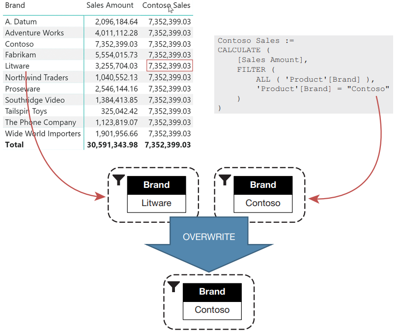
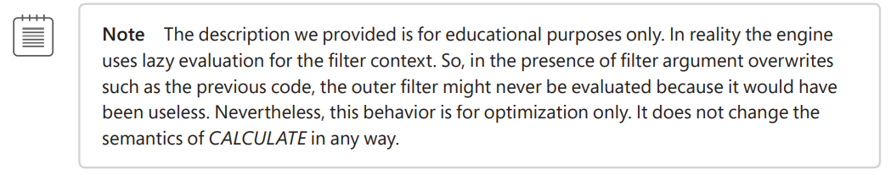

# CALCULATE and CALCULATE TABLE

CALCULATE is the most important, useful, and complex function in DAX. The function itself is simple to learn, it only performs a few tasks. Complexity comes from the fact that 
***CALCULATE and CALCULATETABLE are the only functions in DAX that can create new filter contexts.*** Thus, although they are simple functions, using CALCULATE or CALCULATETABLE in a formula instantly increases its complexity.


## How does it work?
+ CALCULATE makes a copy of the current filter context
+ CALCULATE evaluates each filter argument and produces, for each condition, the list of valid values for the specified columns.
+ If two or more filter arguments affect the same column, they are merged together using an AND operator.
+ CALCULATE uses the new condition to replace existing filters on the columns in the model.
Once the new filter context is ready, CALCULATE applies the filter context to the model, and it computes the first argument: the expression. In the end, CALCULATE restores the original filter context, returning the computed result

 <br>

CALCULATE accepts fi lters of two types:

+ Lists of values, in the form of a table expression. In that case, you provide the exact list of values you want to make visible in the new filter context. The filter can be a table with any number of columns. Only the existing combinations of values in different columns will be considered in the filter.
+ Boolean conditions, such as Product[Color] = “White”. These filters need to work on a single 
column because the result needs to be a list of values for a single column. This type of filter 
argument is also known as predicate.

## Evaluation order of Calculate
Whenever you look at DAX code, the natural order of evaluation is innermost fi rst. For example, look at the following expression:

```dax
Sales Amount Large :=
SUMX ( 
 FILTER ( Sales, Sales[Quantity] >= 100 ),
 Sales[Quantity] * Sales[Net Price]
)
```
DAX needs to evaluate the result of FILTER before starting the evaluation of SUMX. In fact, SUMX
iterates a table. Because that table is the result of FILTER, SUMX cannot start executing before FILTER has finished its job. ***This rule is true for all DAX functions, except for CALCULATE and CALCULATETABLE***. <br>
<br>
Moreover, things are a bit more intricate because CALCULATE changes the fi lter context. All the 
fi lter arguments are executed in the fi lter context outside of CALCULATE, and each fi lter is evaluated independently. The order of filters within the same CALCULATE does not matter. Consequently, all the following measures are completely equivalent:

```dax
Sales Red Contoso :=
CALCULATE (
 [Sales Amount],
 'Product'[Color] = "Red",
 KEEPFILTERS ( 'Product'[Brand] = "Contoso" )
)

Sales Red Contoso :=
CALCULATE (
 [Sales Amount],
 KEEPFILTERS ( 'Product'[Brand] = "Contoso" ),
 'Product'[Color] = "Red"
)

Sales Red Contoso :=
VAR ColorRed = 
 FILTER ( 
 ALL ( 'Product'[Color] ),
 'Product'[Color] = "Red"
 ) 

VAR BrandContoso = 
 FILTER ( 
 ALL ( 'Product'[Brand] ),
 'Product'[Brand] = "Contoso"
 )
```
To make the nested measure call more evident, we can expand Sales Green this way:

```dax
Green calling Red Exp :=
CALCULATE (
 CALCULATE (
 [Sales Amount],
 'Product'[Color] = "Red"
 ),
 'Product'[Color] = "Green"
)
```
1. First, the outer CALCULATE applies the fi lter, Product[Color] = “Green” <br>
2. Second, the inner CALCULATE applies the fi lter, Product[Color] = “Red”. This fi lter overwrites the previous filter. <br>
3. Last, DAX computes [Sales Amount] with a filter for Product[Color] = “Red”

 <br>