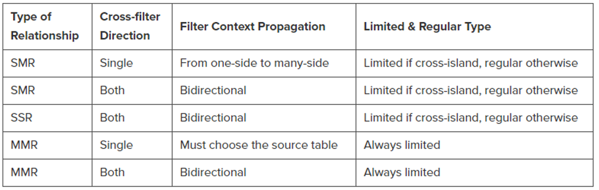

# Relationships

In tabular models, a relationship is a connection between two tables of data. The relationship establishes how the data in the two tables should be correlated.

## Pyhsical Relationships

Relationships are applied and defined in the data model. 

+ **Regular** =  the engine knows that the one-side of the relationship contains unique values
+ **Limitied** = the enginge can not ensure uniqueness or due to technical reasons (Type and Cross filter Direction) -> No Table Expansion
+ **Types** = one-to-many (SMR), one-to-one (SSR), many-to-many (MMR)
+ **Cross-Filter** = Direction used by the filter context. Single (one direction), Both (both direction)
+ **Inactive** = Only one Active Relationship on column allowed. USERELATIONSHIPS **[USERELATIONSHIPS](https://dax.guide/userelationship/)** to apply inactive.

  

## Virtual Relationship

A virtual relationship is a filter applied to the filter context

+ Performance is slower compared to physical relationships
+ They can be achieved by different DAX functions

**[IN](https://dax.guide/op/in/)**  
The IN operator returns TRUE if a row of values exists or contained in a table, otherwise returns FALSE. Except syntax, the IN operator and CONTAINSROW function are functionally equivalent, as in the following example.

**[TREATAS](https://dax.guide/treatas/)**  
Treats the columns of the input table as columns from other tables.For each column, filters out any values that are not present in its respective output column.

**[INTERSECT](https://dax.guide/intersect/)**  
Returns the rows of left-side table which appear in right-side table.

**[CONTAINS](https://dax.guide/contains/)**  
Returns TRUE if there exists at least one row where all columns have specified values.

There are more functions that enables you to traverse a filter to a table. This ist just a short overview.

## Requirements for relationships

+ Single Active Relationship between tables
+ One relationship for each source column
+ Unique identifier for each table (primary Key)
+ Unique lookup columns (The data values in the lookup column must be unique)
+ Compatible data types
+ Composite keys and lookup columns (You cannot use composite keys in a tabular model; you must always have one column that uniquely identifies each row in the table)

## Choosing the right type of relationship

+ A physical relationship is defined in the data model; a virtual relationship only exists in DAX code.
+ A physical relationship defines a constraint on the one-side table of the relationship.
+ A physical relationship is faster than a virtual relationship.

## Performance Priority should be

+ Physical one-to-many relationships to get best performance and the best use of the VertiPaq engine. Calculated physical relationships have the same query performance as relationships on native columns.
+ Bidirectional cross-filter relationships, many-to-many with table expansion, and weak relationships are a second option. They provide good performance and a good use of the engine, although not the best.
+ Virtual relationships are the last choice because of the risk of bad performance. 
