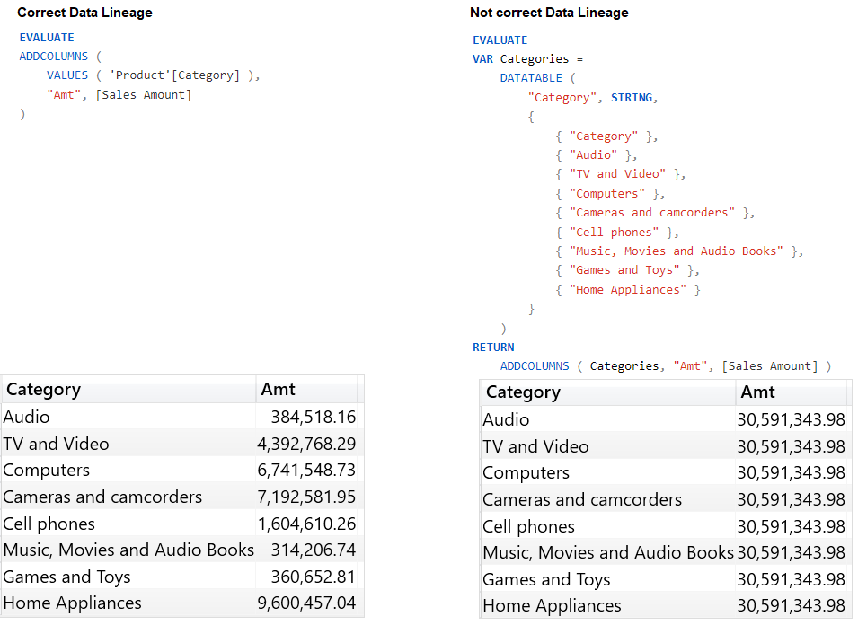

# Data Lineage

Data lineage is a tag. Assigned to every column in a table, this tag identifies the original column in the data model that the values of a column originated from

 <br>

+ For a value to filter the model, DAX needs to know the data lineage of the value itself.
+ A value that represents a column in the data model holds the data lineage of that column. On the other hand, a value that is not linked to any column in the data model is an anonymous value.
+ Usually, DAX handles all the complexity but in cases you need to maintain, changing or creating the lineage, it is important to know how it works.

## Manipulating data lineage

**[TREATAS](https://dax.guide/treatas/)** <br>
Treats the columns of the input table as columns from other tables.For each column, filters out any values that are not present in its respective output column.

```dax
SimpleTreatas = 
CALCULATE (
    [Sales Amount],
    TREATAS({ "Red", "Blue" }, 'Product'[Color])
)
```

**A simple column reference maintains its data lineage, whereas an expression is always anonymous.**

```dax
ADDCOLUMNS (
    VALUES( 'Product'[Color]),
    "Color without lineage", 'Product'[Color] & ""
)
```