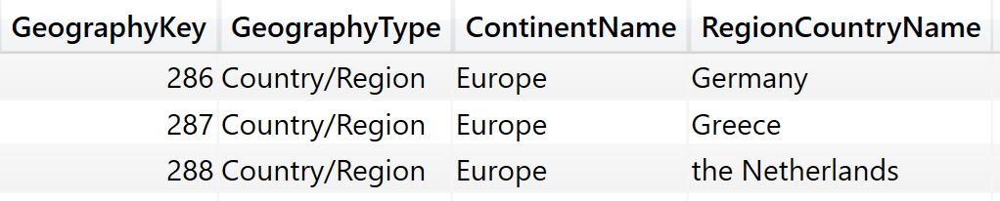
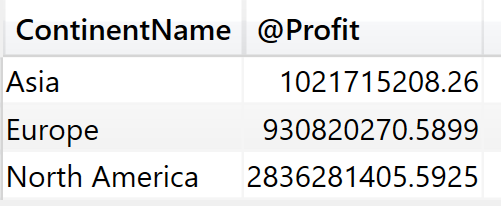
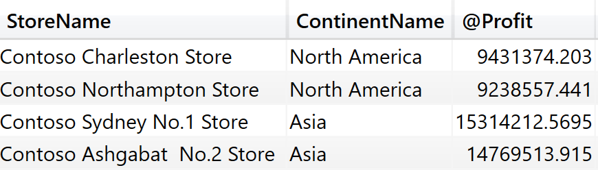
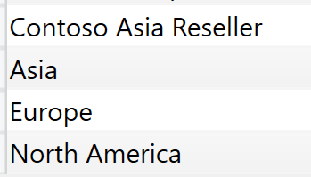
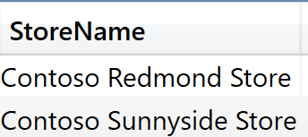
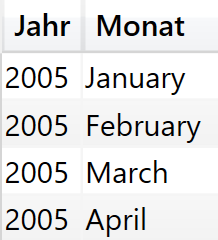
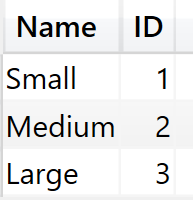
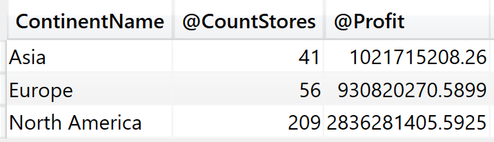
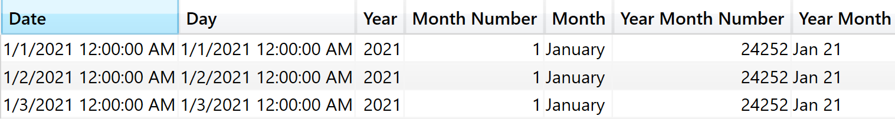

# Virtual Tables

CALCULATE filter arguments are tables. When authoring complex formulas, an ability to build the correct filter table is of paramount importance.

**[CALCULATETABLE](https://dax.guide/calculatetable/)** <br>
Evaluates a table expression in a context modified by filters.

```dax
EVALUATE
CALCULATETABLE ( Geography, Geography[ContinentName] = "Europe" )
```

 <br>

**[ADDCOLUMNS](https://dax.guide/addcolumns/)** <br>
Returns a table with new columns specified by the DAX expressions.

```dax
EVALUATE
ADDCOLUMNS ( VALUES ( Geography[ContinentName] ), "@Profit", [Profit] )
```

 <br>

**[SUMMARIZE](https://dax.guide/summarize/)** <br>
Creates a summary of the input table grouped by the specified columns.

```dax
EVALUATE
SUMMARIZE(Sales, Stores[StoreName], Geography[ContinentName])
```

 <br>

**[SUMMARIZECOLUMNS](https://dax.guide/summarizecolumns/)** <br>
Create a summary table for the requested totals over set of groups.

```dax
EVALUATE
SUMMARIZECOLUMNS (
    Stores[StoreName],
    Geography[ContinentName],
    "@Profit", [Profit]
)
```

 <br>

**[CROSSJOIN](https://dax.guide/crossjoin/)** <br>
Returns a table that is a crossjoin of the specified tables.

```dax
EVALUATE
CROSSJOIN ( VALUES ( Stores[StoreName] ), VALUES ( Geography[ContinentName] ) )
```

 <br>

**[UNION](https://dax.guide/union/)** <br>
Returns the union of the tables whose columns match.

```dax
EVALUATE
Union ( VALUES ( Stores[StoreName] ), VALUES ( Geography[ContinentName] ) )
```

 <br>

**[INTERSECT](https://dax.guide/intersect/)** <br>
Returns the rows of left-side table which appear in right-side table.

```dax
DEFINE
    VAR tbl_Stores =
        VALUES ( Stores[StoreName] )
    VAR tbl_Filter = { "Contoso Redmond Store", "Contoso Sunnyside Store" }

EVALUATE
INTERSECT ( tbl_Stores, tbl_Filter )
```

 <br>

**[EXCEPT](https://dax.guide/except/)** <br>
Returns the rows of left-side table which do not appear in right-side table.

```dax
DEFINE
    VAR tbl_Stores =
        VALUES ( Stores[StoreName] )
    VAR tbl_Filter = { "Contoso Redmond Store", "Contoso Sunnyside Store" }
    VAR tbl_ExceptStores =
        FILTER ( tbl_stores, NOT Stores[StoreName] IN ( tbl_Filter ) )

EVALUATE
EXCEPT ( tbl_Stores, tbl_ExceptStores )
```

 <br>

**[SELECTCOLUMNS](https://dax.guide/selectcolumns/)** <br>
Returns a table with selected columns from the table and new columns specified by the DAX expressions.

```dax
EVALUATE
DISTINCT (
    SELECTCOLUMNS (
        'Calendar',
        "Jahr", 'Calendar'[YearName],
        "Monat", 'Calendar'[MonthName]
    )
)
```

 <br>

**[DATATABLE](https://dax.guide/datatable/)** <br>
Returns a table with data defined inline.

```dax
EVALUATE
DATATABLE (
    "Name", STRING,
    "ID", INTEGER,
    {
        { "Small",  1 },
        { "Medium", 2 },
        { "Large",  3 }
    }
)
ORDER BY [ID]   
```

 <br>

**[GENERATESERIES](https://dax.guide/generateseries/)** <br>
Returns a table with one column, populated with sequential values from start to end.

```dax
EVALUATE
GENERATESERIES ( 1, 3, 0.5 )
```

 <br>

**[NATURALINNERJOIN](https://dax.guide/naturalinnerjoin/)** <br>
Joins the Left table with right table using the Inner Join semantics.

```dax
DEFINE
    VAR tbl_Stores =
        VALUES ( Stores[StoreName] )
    VAR tbl_Filter =
        DATATABLE (
            "Stores[StoreName]", STRING,
            {
                { "Contoso Redmond Store" },
                { "Contoso Sunnyside Store" }
            }
        )

EVALUATE
NATURALINNERJOIN ( tbl_Stores, TREATAS ( tbl_Filter, Stores[StoreName] ) )
```

 <br>


**[NATURALLEFTOUTERJOIN](https://dax.guide/naturalleftouterjoin/)** <br>
Joins the Left table with right table using the Left Outer Join semantics.

```dax
DEFINE
    VAR StoresByContinent =
        DISTINCT (
            SELECTCOLUMNS (
                ADDCOLUMNS (
                    SUMMARIZE ( Sales, Stores[StoreName], Geography[ContinentName] ),
                    "@CountStores", CALCULATE ( COUNTROWS ( Stores ), REMOVEFILTERS ( Stores[StoreName] ) )
                ),
                "Geography[ContinentName]", Geography[ContinentName],
                "@CountStores", [@CountStores]
            )
        )
    VAR ProfitByContinten =
        SUMMARIZECOLUMNS ( Geography[ContinentName], "@Profit", [Profit] )

EVALUATE
NATURALLEFTOUTERJOIN(storesByContinent, ProfitByContinten)
```

 <br>

**[GENERATE](https://dax.guide/generate/)** <br>
The second table expression will be evaluated for each row in the first table. Returns the crossjoin of the first table with these results.

```dax
DEFINE
VAR BaseCalendar =
    CALENDAR ( DATE ( 2021, 1, 1 ), DATE ( 2021, 1, 3 ) )
EVALUATE
    GENERATE (
        BaseCalendar,
        VAR BaseDate = [Date]
        VAR YearDate = YEAR ( BaseDate )
        VAR MonthNumber = MONTH ( BaseDate )
        VAR YearMonthNumber = YearDate * 12 + MonthNumber - 1
        RETURN ROW (
            "Day", BaseDate,
            "Year", YearDate,
            "Month Number", MonthNumber,
            "Month", FORMAT ( BaseDate, "mmmm" ),
            "Year Month Number", YearMonthNumber,
            "Year Month", FORMAT ( BaseDate, "mmm yy" )
        )
    )
```

 <br>