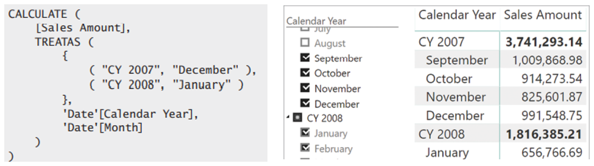

# Special Filter context

## Shadow Filter context:
**[ALLSELECTED](https://dax.guide/allselected/)** is the only function shadow filter context and thus may makes it the most complex formula of all in terms of technical implementation. Usually, you can think of the function, as it would pick all the filter coming from outside of a visual. But a DAX-Query is actually not aware of any current visual.

+ When used as a table function, ALLSELECTED returns the set of values as visible in the last shadow filter context.
+ When used as a CALCULATE modifier, ALLSELECTED restores the last shadow filter context on its parameter.The details and technical function is beyond the scope of that training.

## Aut Exists:
Auto-exist is a technology built into DAX with the simple goal of avoiding useless calculations.

## Arbitrarly shaped filter:
+ Filters in the filter context can have two different shapes: simple filters and arbitrarily shaped filters.
+ Arbitrarily shaped filters can be created by using a PivotTable in Excel, DAX Code or hierarchical slicers.
+ Arbitrarily shaped filters are complex to use in DAX because of the way CALCULATE might change them in the filter context.

