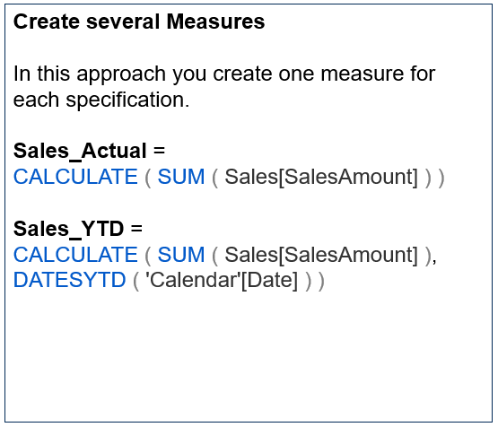
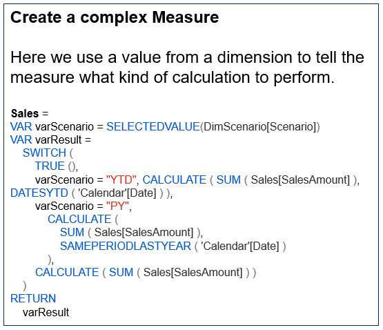
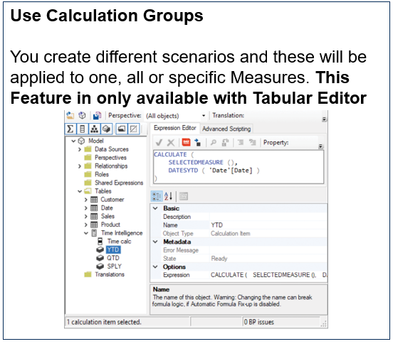

# Calculation Groups

+ In 2019, DAX received a major update with the introduction of calculation groups. Calculation groups are a utility feature inspired from a similar feature available in MDX, known as calculated members
+ Calculation Groups allow you to write calculations in a more generic way.

**Scenario**
Imagine you want to use time intelligence to display your measure with different scenarios, like Actual value, Year-To-Date or Previous year.
this can be realized as follows:

  

  

  