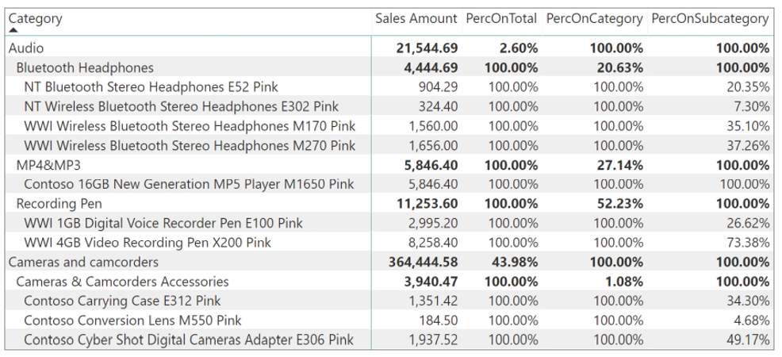
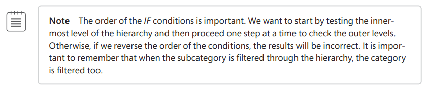
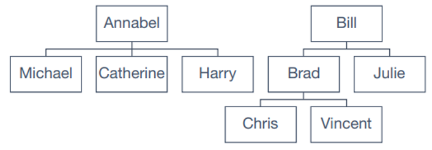

# Working with Hierachies

Hierarchies are oftentimes present in data models to make it easier for the user to slice and dice using predefi ed exploration paths. Nevertheless, DAX does not have any built-in function providing a calculation over hierarchies. Computing a simple calculation like the ratio to parent requires complex DAX code, and the support for calculations over hierarchies proves to be a challenge in general.

## Hierarchical Calculations

 <br>

```dax
PercOnParent :=
VAR CurrentSales = [Sales Amount]
VAR SubcategorySales =
    CALCULATE ( [Sales Amount], ALLSELECTED ( Product[Product Name] ) )
VAR CategorySales =
    CALCULATE ( [Sales Amount], ALLSELECTED ( Product[Subcategory] ) )
VAR TotalSales =
    CALCULATE ( [Sales Amount], ALLSELECTED ( Product[Category] ) )
VAR RatioToParent =
    IF (
        ISINSCOPE ( Product[Product Name] ),
        DIVIDE ( CurrentSales, SubcategorySales ),
        IF (
            ISINSCOPE ( Product[Subcategory] ),
            DIVIDE ( CurrentSales, CategorySales ),
            IF ( ISINSCOPE ( Product[Category] ), DIVIDE ( CurrentSales, TotalSales ) )
        )
    )
RETURN
    RatioToParent
```

 <br>

**[ISINSCOPE](https://dax.guide/isinscope/)** <br>
Returns true when the specified column is the level in a hierarchy of levels.

## Parent-Child-Hierarchies

 <br>

**[PATH](https://dax.guide/path/)** <br>
Returns a string which contains a delimited list of IDs, starting with the top/root of a hierarchy and ending with the specified ID.

**[PATHCONTAINS](https://dax.guide/pathcontains/)** <br>
Returns TRUE if the specified Item exists within the specified Path.

**[PATHITEM](https://dax.guide/pathitem/)** <br>
Returns the nth item in the delimited list produced by the Path function.

**[PATHLENGTH](https://dax.guide/pathlength/)** <br>
Returns returns the number of items in a particular path string. This function returns 1 for the path generated for an ID at the top/root of a hierarchy.