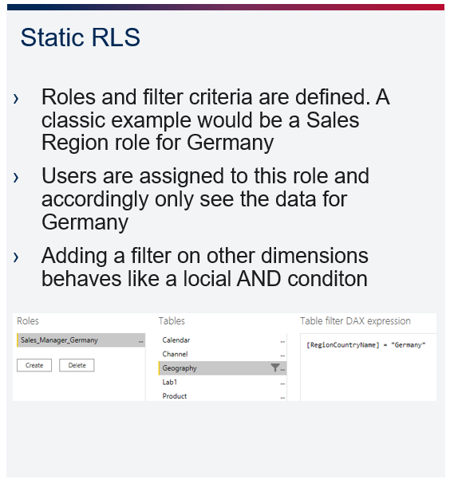
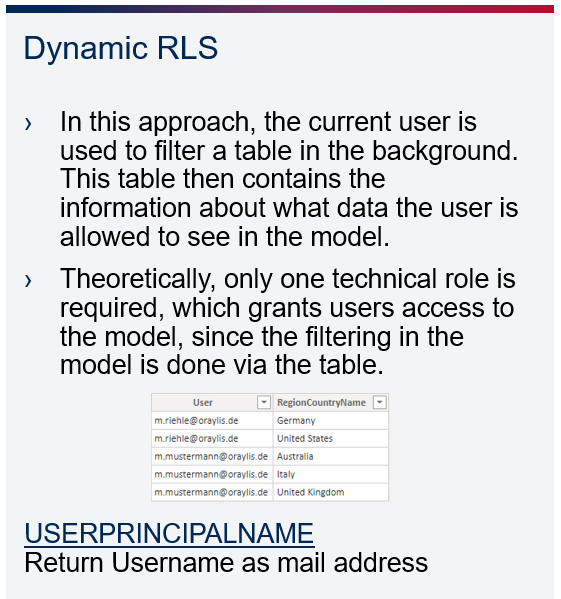
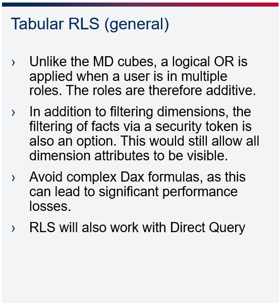

# Row Level Security

+ Secure the data according to the privileges of the current user connected to the model
+ Technically, this is nothing more than applying a filter to the data. The difference to regular filtering in the report is that the filtering is done automatically via roles and cannot be influenced by the user.

  

  

  