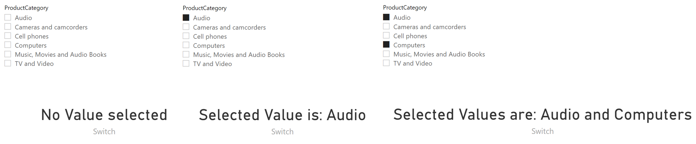
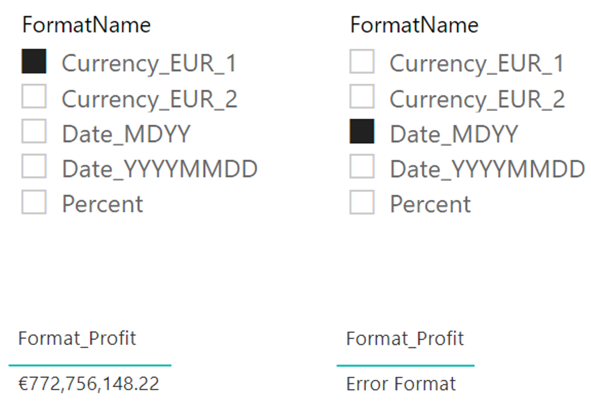
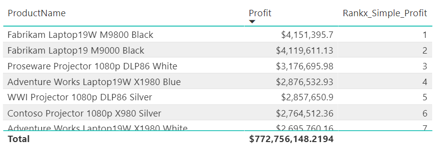
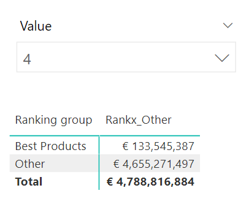
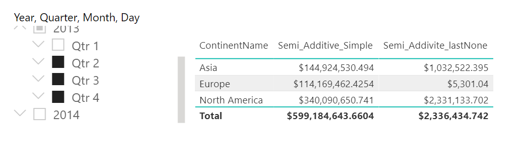
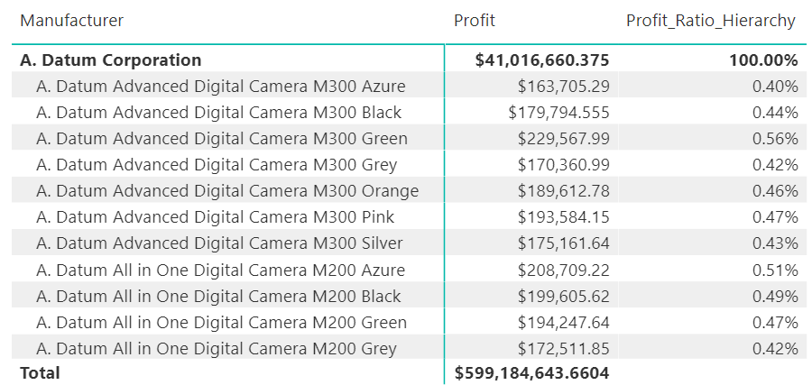

# Hands On Advanced DAX

## SWITCH

In this example, we want to use the SWITCH function to execute different blocks of code depending on how many ProductCategories have been selected. If only one has been selected, then the card visual should only show the one value, in case of multiple selection the categories should be concatenated with "and" and also in case of no selection this should be shown.

For illustration the function ISFILTERED and HASONEVALUE was used. This was the common way to select a chosen value until the implementation of the SELECTEDVALUE function.
```dax
Switch = 
VAR varSelectedValue =
    IF (
        NOT ISFILTERED ( ProductCategory[ProductCategory] ),
        "NotFiltered",
        IF (
            HASONEVALUE ( ProductCategory[ProductCategory] ),
            "OneValue",
            "MultipleValues"
        )
    )
VAR varSwitch =
    SWITCH (
        varSelectedValue,
        "OneValue",
            CONCATENATE (
                "Selected Value is: ",
                SELECTEDVALUE ( ProductCategory[ProductCategory] )
            ),
        "MultipleValues",
            CONCATENATE (
                "Selected Values are: ",
                CONCATENATEX (
                    VALUES ( ProductCategory[ProductCategory] ),
                    ProductCategory[ProductCategory], 
                    " and "
                )
            ),
        "No Value selected"
    )
RETURN
    varSwitch
```

 <br>

## Format
With the help of the FORMAT function, measures can be displayed in any format. In this example we will read a selected format and apply it to the measure. Note that not every format is applicable to every measure.

```dax
Format_Profit = 
VAR varSelectedFormatName =
    SELECTEDVALUE ( 'format'[FormatName], "MoreSelected" )
VAR varSelectedFormat =
    SELECTEDVALUE ( 'format'[Format], "MoreSelected" )
RETURN
    IFERROR ( FORMAT ( [Profit], varSelectedFormat ), "Error Format" )
```

 <br>

## RANKX simple

With this simple RANKX function we want to show which products achieve the highest profit.

```dax
Rankx_Simple_Profit = 
//Use All not values to remove filter from a single Product
VAR varProductProfit =
    ALL ( 'Product'[ProductName] )
VAR varRank =
    RANKX ( varProductProfit, [Profit] )
    
//Avoid a Rank for Total Row
RETURN
    IF ( ISFILTERED ( 'Product' ), varRank )
```

 <br>

## RANKX with custom Rank
In this somewhat more complex example, the possibility of an individual evaluation of the best products is intended to be enabled, whereby the profit of the top X products is displayed, while all others are displayed on "Ohthers".
In addition to the DAX calculation, another table must be created that integrates the row "ohters" into the model.

Table
```dax
Product Ranking = 
UNION (
    SELECTCOLUMNS (
        ALLNOBLANKROW ( 'Product'[ProductName]),
        "Ranking name", 'Product'[ProductName],
        "Ranking group", "Best Products"
    ),
    { ( "Other", "Other" ) }
)
```

Measure
```dax
Rankx_Other = IF (
    ISINSCOPE ( 'Product Ranking'[Ranking group] ),
    VAR NumOfProducts = SELECTEDVALUE('TopN'[Value],1)
    VAR RankingGroup =
        SELECTEDVALUE ( 'Product Ranking'[Ranking group] )
    VAR TopProducts =
        TOPN ( NumOfProducts, ALLSELECTED ( 'Product Ranking' ), [Profit] )
    RETURN
        SWITCH (
            RankingGroup,
            "Best Products",
                CALCULATE ( [Profit], KEEPFILTERS ( TopProducts ) ),
            "Other",
                IF (
                    NOT ISINSCOPE ( 'Product Ranking'[Ranking Name] ),
                    VAR TopAmount =
                        CALCULATE ( [Profit], TopProducts )
                    VAR AllAmount =
                        CALCULATE ( [Profit], ALLSELECTED ( 'Product Ranking' ) )
                    VAR OtherAmt = AllAmount - TopAmount
                    RETURN
                        OtherAmt
                )
        ),
    [Profit]
)
```

 <br>

## Semi Additive Measures

simple example of semi addive measures. The first measure shows an aggregation of delta values. This option is useful when, for example, stocks have to be calculated. The second example shows in contrast the profit at the level of the last profit date

```dax
Semi_Additive_Simple = 
var varMaxDate = MAX('Calendar'[DateKey])
var varProfit = CALCULATE([Profit], 'Calendar'[DateKey] <= varMaxDate)
return
varProfit
```

```dax
Semi_Addivite_lastNone = 
var LastSalesDate = LASTNONBLANK('Calendar'[DateKey], [Profit])
Return
CALCULATE([Profit], 'Calendar'[DateKey] = LastSalesDate)
```

 <br>

## ISINSCOPE

With the help of the ISINSCOPE function we can find ratio values on different hierarchy levels. 

```dax
Profit_Ratio_Hierarchy = 
VAR Profit = [Profit]
VAR totalProfitManufacture =
    CALCULATE ( [Profit], REMOVEFILTERS ( 'Product'[ProductName] ) )
RETURN
    SWITCH (
        TRUE (),
        AND ( ISINSCOPE ( 'Product'[ProductName] ), NOT ISBLANK ( Profit ) ), DIVIDE ( Profit, totalProfitManufacture ),
        AND ( ISINSCOPE ( 'Product'[Manufacturer] ), NOT ISBLANK ( Profit ) ), DIVIDE ( Profit, profit ),
        BLANK ()
    )
```

 <br>