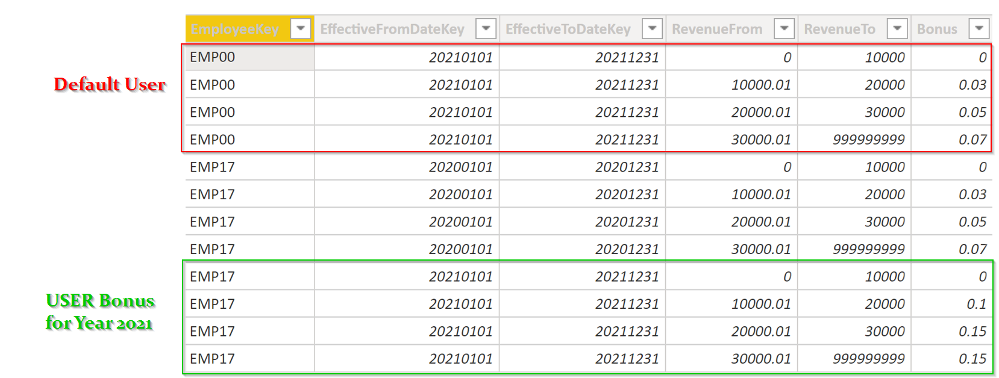
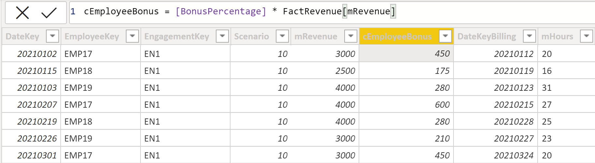

# Cumulative Bonus

In this case, we would like to calculate an individual bonus for each employee. The accumulated revenue in a certain period is taken into account. Depending on the exceeded limit, the employee then receives a bonus retrospectively for all sales.

## Preparation
For the conversion, an additional table is required in which the bonus rate and the time periods for each employee are maintained.

 <br>

## Implementation

The calculation is done as a calculated column in the FactRevenue table. This then assigns the corresponding bonus to each turnover based on the calculated percentage rate.

 <br>

## Required Measures

Bonus Border From
```dax
BonusDateFrom = 
VAR selectedDate =
    SELECTEDVALUE ( FactRevenue[DateKey] )
VAR selectedEmployee =
    SELECTEDVALUE ( FactRevenue[EmployeeKey] )
VAR Result =
    CALCULATE (
        MAX ( FactBonus[EffectiveFromDateKey] ),
        FILTER (
            FactBonus,
            ( FactBonus[EmployeeKey] = selectedEmployee
                || FactBonus[EmployeeKey] = "EMP00" )
                && FactBonus[EffectiveFromDateKey] <= selectedDate
                && FactBonus[EffectiveToDateKey] >= selectedDate
        )
    )
RETURN
    Result
```
Bonus Border To
```dax
BonusDateTo = 
VAR selectedDate =
    SELECTEDVALUE ( FactRevenue[DateKey] )
VAR selectedEmployee =
    SELECTEDVALUE ( FactRevenue[EmployeeKey] )
VAR Result =
    CALCULATE (
        MIN ( FactBonus[EffectiveToDateKey] ),
        FILTER (
            FactBonus,
            ( FactBonus[EmployeeKey] = selectedEmployee
                || FactBonus[EmployeeKey] = "EMP00" )
                && FactBonus[EffectiveFromDateKey] <= selectedDate
                && FactBonus[EffectiveToDateKey] >= selectedDate
        )
    )
RETURN
    Result
```

Cumulative Revenue within borders
```dax
CumlativeRevenue = 
var selectedEmployee = SELECTEDVALUE(FactRevenue[EmployeeKey])
RETURN
IF(
    ISBLANK([BonusDateFrom]) || 
    ISBLANK([BonusDateTo]), 
    BLANK(),
    CALCULATE(
        [Revenue],
        FILTER(
            ALL(FactRevenue),
            FactRevenue[EmployeeKey] = selectedEmployee &&
            FactRevenue[DateKey] >= [BonusDateFrom] &&
            FactRevenue[DateKey] <= [BonusDateTo]
        )
    )
)
```

Bonus Percentage based on the cumulative Revenue
```dax
BonusPercentage = 
var DateFrom = [BonusDateFrom]
var DateTo = [BonusDateTo]
var CumulativeSales = [CumlativeRevenue]
var selectedEmployee = SELECTEDVALUE(FactRevenue[EmployeeKey])

RETURN
IF(
    NOT(ISBLANK(DateFrom)||ISBLANK(DateTo)),
    CALCULATE(
        MAX(FactBonus[Bonus]),
        FILTER(
            FactBonus,
            FactBonus[BonusDateFrom]=DateFrom &&
            FactBonus[BonusDateTo]=DateTo &&
            (FactBonus[EmployeeKey] = selectedEmployee || 
                FactBonus[EmployeeKey] = "EMP00"
            ) &&
            FactBonus[RevenueFrom]<=CumulativeSales &&
            FactBonus[RevenueTo]>= CumulativeSales
        )
    )
)
```

Employee Bonus is a simple sum of the calculated column
```dax
EmployeeBonus = sum(FactRevenue[cEmployeeBonus])
```

