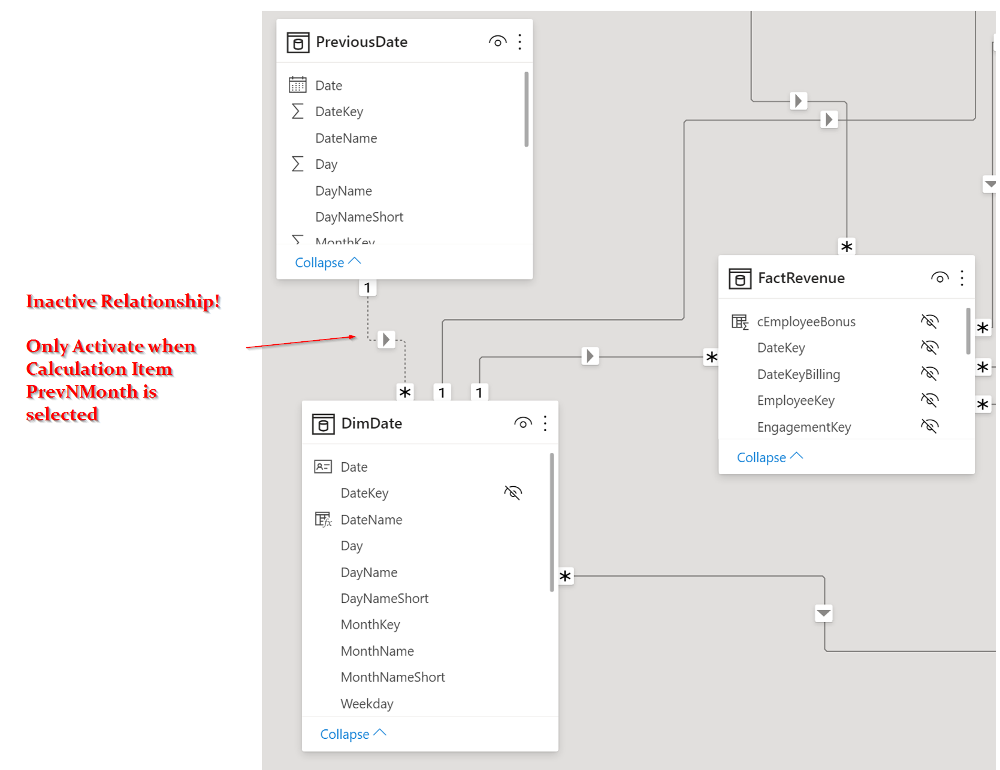
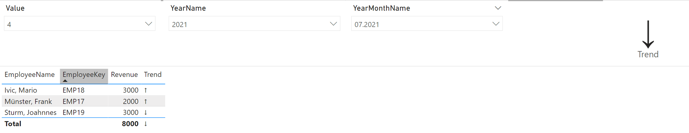

# Custom Trend Analysis

In this example, we want to determine a trend. The logic applied is quite simple, we divide the evaluation into two equal periods. If the second half performs better than the first, we assume a positive trend. As a return value we do not want a number but an arrow as a symbol. We would like to keep the period which is to be evaluated flexible and should therefore be adaptable in the report.

## Preparation
At the beginning we need a table with which we can later select the flexible monthly period

```dax
DimFilterN = GENERATESERIES(1,30,1)
```

In order to be able to validate the results later, we would like to show the timeline of the revenue for the selected months completely, even though a specific month was selected in the report. To achieve this, we create a second date dimension that has an indirect relationship to the actual date dimension. Using a Calculation Group we then set the relationship to override the selected time period of the date dimension.

```dax
VAR NumOfMonths =
    SELECTEDVALUE ( 'DimFilterN'[Value] ) * ( -1 )
VAR ReferenceDate =
    MAX ( 'DimDate'[Date] )
VAR PreviousDates =
    DATESINPERIOD ( 'PreviousDate'[Date], ReferenceDate, NumOfMonths, MONTH )
VAR Result =
    CALCULATE (
        SELECTEDMEASURE (),
        REMOVEFILTERS ( 'DimDate' ),
        KEEPFILTERS ( PreviousDates ),
        USERELATIONSHIP ( 'PreviousDate'[DateKey], 'DimDate'[DateKey] )
    )
RETURN
    Result
```

 <br>

## Implementation

Trend Measures divides the selected period in two timeframes and calculates the average revenue for both. Finally, both are compared. If the latter period shows a higher average, we assume a positive trend.

```dax
Trend =
VAR SelectedMonthValue =
    SELECTEDVALUE ( DimFilterN[Value] )
VAR CurrentYearMonth =
    SELECTEDVALUE ( DimDate[YearMonthKey] )
VAR LastNMonthRevenue =
    FILTER (
        CALCULATETABLE (
            TOPN (
                SelectedMonthValue,
                ADDCOLUMNS ( VALUES ( DimDate[YearMonthKey] ), "tempRevenue", [Revenue] ),
                DimDate[YearMonthKey], DESC
            ),
            DimDate[YearMonthKey] <= CurrentYearMonth,
            REMOVEFILTERS ( DimDate )
        ),
        [tempRevenue] <> BLANK ()
    )
VAR WeeksInRange =
    COUNTROWS ( SUMMARIZE ( LastNMonthRevenue, [YearMonthKey] ) )
VAR FirstHalfAvg =
    AVERAGEX (
        TOPN ( INT ( WeeksInRange / 2 ), LastNMonthRevenue, [YearMonthKey], ASC ),
        [tempRevenue]
    )
VAR SecondHalfAvg =
    AVERAGEX (
        TOPN ( INT ( WeeksInRange / 2 ), LastNMonthRevenue, [YearMonthKey], DESC ),
        [tempRevenue]
    )
VAR growthRate =
    DIVIDE ( FirstHalfAvg, SecondHalfAvg )
VAR Result =
    IF (
        NOT ISBLANK ( growthRate ),
        IF ( growthRate > 1, "↓", IF ( growthRate < 1, "↑", "→" ) )
    )
RETURN
    Result
```

## Result

 <br>

