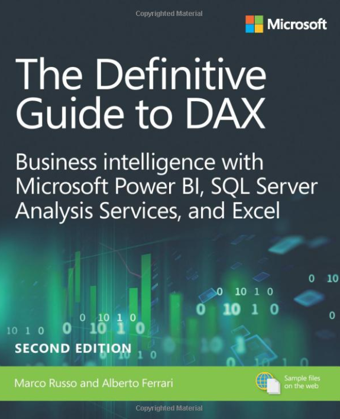
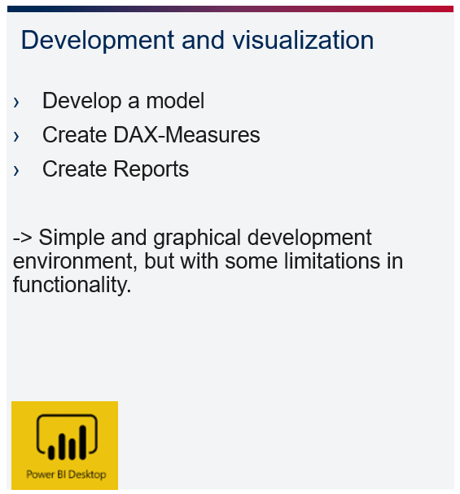
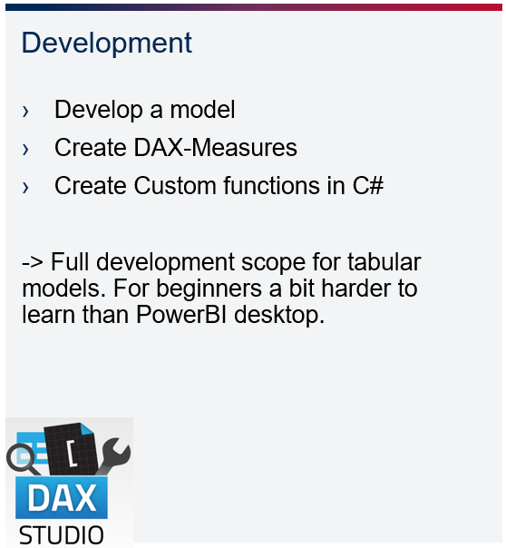
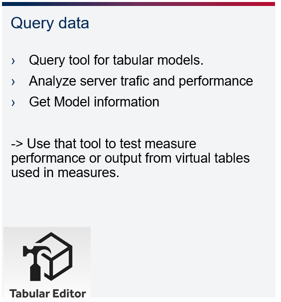

# Documentation and Development Tools

## The most important sources
Here you will find the most important pages and books you need to become a true DAX expert.

***Definitive Guide to DAX***  
 
  
 
In this book by Marco Russo and Alberto Ferrari you will find all information about DAX and the Tabular model. In addition to the DAX concepts and useful example calculations, the book also provides technical background on the tabular model. Justifiably, this book is considered the bible for every DAX expert.

### ***SQL BI***  
[Link_SqlBI](https://www.sqlbi.com/)  
On this website of Marco Russo and Alberto Ferrari you will find many useful articles about Dax and Tabular Model. There are also many useful download links to tools that might be interesting for you.

### ***Dax Patterns***  
[Link_DaxPatterns.com](https://www.daxpatterns.com/)  
The next useful page from Marco and Alberto. Here, the two have taken the effort to create a template for the most common used cases. A look at this page is always worthwhile if you have to solve common problems. 

### ***DAX Guide***  
[Link_DaxGuide](https://dax.guide/)  
ot surprisingly, the last page is also from the guys at SqlBi. With the Dax guide they have created a very useful documentation of all the DAX formulas. Especially useful are the linked videos and blog posts, as well as all the additional information such as the necessary compatibility level of the tabular engine.

## Development Tools
In the world of taublar modeling, there are now many useful tools. This is not least because practically anyone can develop their own tool and embed it in Power Bi. In the world of taublar modeling, there are now many useful tools. This is not least because practically anyone can develop their own tool and embed it in Power Bi.

###  ***Power BI Desktop***  
  
[Download_PowerBI](https://powerbi.microsoft.com/de-de/downloads/)  

###  ***DAX Studio***  
  
[Download_DaxStudio](https://daxstudio.org/downloads/)  

###  ***Tabular Editor***  
  
[Download_DaxStudio](https://www.sqlbi.com/tools/tabular-editor/)  

