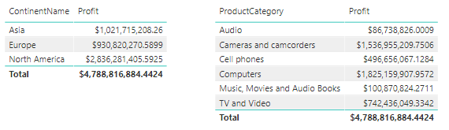
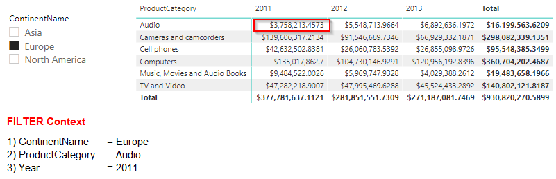
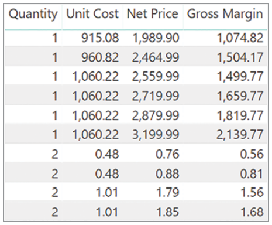
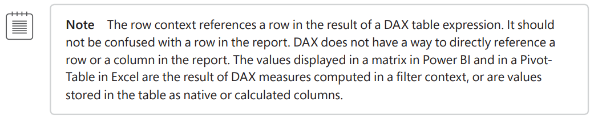

# Evaluation Context

Evaluation Context is: The environment in which a DAX formula is evaluated in. So, when we write a DAX formula it gets evaluated within an environment. The DAX formula evaluated will be directly dependant on the Evaluation Context. This means the result returned can be different depending on the context, even if the DAX formula used is the same.

If this is your first read on Evaluation Context, you may be wondering why it is possible to get different results when using the same DAX formula. Let’s make sure we make this clear before moving on. Take a look at the below measure:

```dax
Profit = SUM(Sales[SalesAmount]) - SUM(Sales[TotalCost])
```
 <br>

***What types of Evaluation Context exist?*** <br>
There are only two different types of Evaluation Context. The ***Filter Context*** and the ***Row Context***. Let's take a closer look at both of them, since they form the foundation of the DAX Engine. 

***What is the diffrence?*** <br>
The filter context filters data, whereas the row context iterates tables. 
When DAX is iterating, it is not filtering; and when it is filtering, it is not iterating


## Filter-Context
DAX evaluates all formulas within a respective context. Even though the formula is 
the same, the result is different because DAX executes the same code against different 
subsets of data. This context is named Filter Context and, as the name suggests, it is a context that filters tables.

 <br>

+ All DAX expressions are evaluated inside a context.
+ The purpose of the filter context is, as its name implies, to filter tables.
+ Filter context executes DAX code against a subset of Data
+ Visual interactions in Power BI creates such a context


## Row-Context
The Row-Context is not a tool to filter tables, like the Filter-Context. Instead, it is used to interate over tables and evaluate column values.

Here is an example using a calculated column
```dax
Sales[Gross Margin] = Sales[Quantity] * ( Sales[Net Price] - Sales[Unit Cost] )
```
 <br>
As expected, for each row of the table there is a different value in the calculated column. Indeed, because there are given values in each row for the three columns used in the expression, it comes as a natural consequence that the fi nal expression computes different values. As it happened with the filter context, the reason is the presence of an evaluation context. This time, the context does not filter a table. Instead, it identifies the row for which the calculation happens. <br>
<br>
 

+ The row context references a row in the result of a DAX table expression
+ Calculated columns always act in a row context
+ A row in a report is not a row context
+ To create a row context in a DAX-Formula use one of the X-Function like SUMX