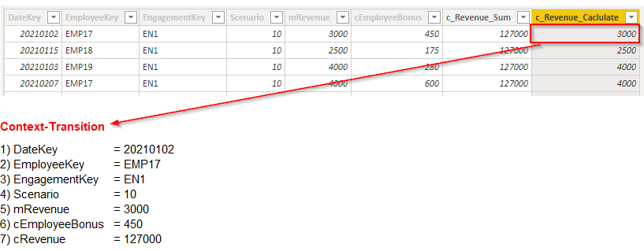

# Context Transition

***Context transition creates a Filter-Context out of a Row-Context*** <br>
During an iteration, CALCULATE adds a filter argument for each of the columns of the iterated table. This happens even the filter arguments are not visible.

Important considerations:

+ Context transition is expensive: For each iterated row a filter context is created
+ It is not filtering only one row. When the row context is moved to a filter context through context transition, the newly created filter context filters all the rows with the same set of values.
+ The filter uses columns that are not visible in the formula. All iterated columns create the context
+ Context transition is invoked whenever there is a filter context.  Have in mind that there is always a row context in calculated columns

the concept can be shown most simply with a calculated column:

```dax
c_Revenue_Sum = 
    SUM(FactRevenue[mRevenue])

c_Revenue_Caclulate = 
    CALCULATE(SUM(FactRevenue[mRevenue]))
```
 <br>