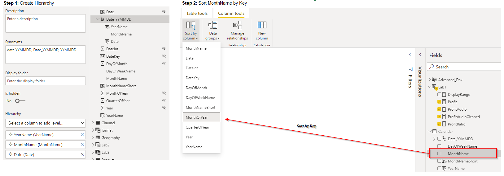

# Lab 1: Solution

1. Calculate the profit as a Measure (SalesAmount – TotalCost)
```dax
Profit = SUM(Sales[SalesAmount]) - SUM(Sales[TotalCost])
```
2. Calculate the profit as a calculated column (Sales – TotalCost – DiscountAmount)
```dax
cProfit = CALCULATE(SUM(Sales[SalesAmount]) - SUM(Sales[TotalCost]))
```
3. Create a calculated column in the Calender with the MonthNameShort (Jun, Aug etc.)
```dax
MonthNameShort = FORMAT('Calendar'[DateKey], "MMM") 
```
4. Create a Hierarchy in the Calendar YYYYMMDD and set the right sort order per month
 <br>
5. Create a Measure that is only returning the Profit for ProductCategegory Audio
```dax
ProfitAudio
    = CALCULATE ( [Profit], ProductCategory[ProductCategory] = "Audio" )
```
6. Create the same Measure as in 3 but avoid returning a value if no profit for a ProductCategory exists
```dax
ProfitAudioCleaned = 
VAR varProfit = [Profit]
RETURN
    IF (
        varProfit <> 0,
        CALCULATE ( [Profit], ProductCategory[ProductCategory] = "Audio" ),
        BLANK ()
    )
```
7. Show the ratio of profit per product categegory to total profit
```dax
ProfitRatio = 
VAR varProfitCategory = [Profit]
VAR varTotalProfit =
    CALCULATE ( [Profit], ALLSELECTED ( ProductCategory[ProductCategory] ) )
RETURN
    DIVIDE ( varProfitCategory, varTotalProfit )
```
8. Create a calculated column that is showing accumulated profit per Day (All profit <= Date)
```dax
cProiftAcc
    = CALCULATE (
        [Profit],
        FILTER ( Sales, Sales[DateKey] <= EARLIER ( Sales[DateKey] ) )
    )
```
9. Create a measure that is displaying the selected time range (if one selected Jun 2021 if two ore more Jun 2021 – Sep 2021)
```dax
DisplayRange = 

    var SelectedPeriodKeys = VALUES('Calendar'[MonthOfYear])
    var PeriodNames = SUMMARIZE('Calendar', 'Calendar'[MonthOfYear], 'Calendar'[MonthNameShort], 'Calendar'[YearName])
    var Result =
        CONCATENATEX(PeriodNames,
            var CurrentPeriodKey = 'Calendar'[MonthOfYear]
            var CurrentPeriodName = 'Calendar'[MonthNameShort]
            var CurrentCalendarYearName = 'Calendar'[YearName]          
            var isPrevSelected = CONTAINS(SelectedPeriodKeys,'Calendar'[MonthOfYear], CurrentPeriodKey - 1)
            var isNextSelected = CONTAINS(SelectedPeriodKeys,'Calendar'[MonthOfYear], CurrentPeriodKey + 1)
            
            
            Return 
                if (
                    Not (isNextSelected && isPrevSelected),
                    CurrentPeriodName & " " & CurrentCalendarYearName & if(isNextSelected, "-", ", ")
                ),
                "",
            'Calendar'[MonthOfYear]
        )
    Return 
        LEFT(Result, LEN(Result) - 2)
```