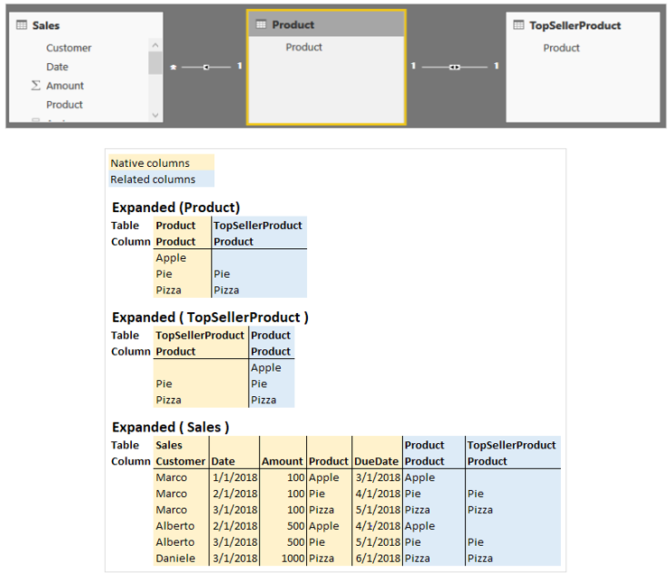
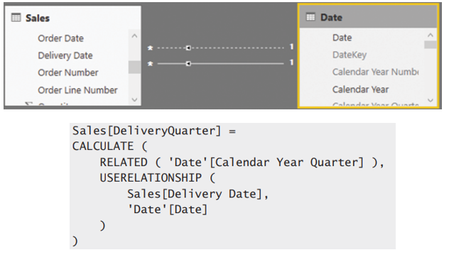
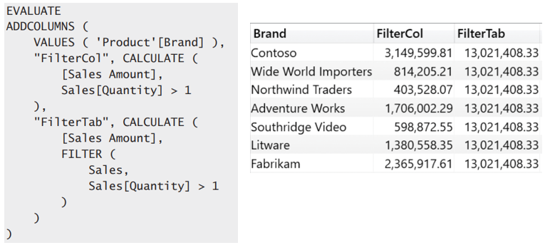

# Expanded Table

## Definition
In DAX, every table has a matching expanded version. The expanded version of a table contains all the columns of the original table, plus all the columns of the tables that are on the one-side of a chain of many-to-one relationships starting from the source table.  

Table expansion **goes towards the one-side**. Therefore, to expand a table, one starts from the base table and adds to the base table all the columns of the related tables that are on the one-side of any relationships. An expanded table is created by joining the columns of two tables into a larger table using a FULL OUTER JOIN. However, regular many-to-one relationships use the usual LEFT OUTER JOIN.  

Table expansion has nothing to do with bidirectional filtering. Expansion always happens to the 1-side of a relationship. If you activate the bidirectional cross-filter on a relationship, you are not relying on table expansion. Instead, the engine pushes certain filtering conditions in the code in order to apply the filters on both sides. Thus, in the previous model, if you enable bidirectional cross-filter on the relationship between Sales and Product, this will not add the columns of the Sales table to the expanded Product table.

  

## What you need to keep in mind

+ RELEATED and USERELATIONSHIP  
Both function help you to access the expanded table  
RELATED 			= Requires a ROW-Context  
USERELATIONSHIP 	= Acts in Filter-Conter

+ table expansion occurs when the table is defined  
Whenever you create or address a table in your data model. The table expansion is happening when you define atable.

+ There is a huge difference between filtering a table vs a column  
Using table filters is always challenging because of table expansion. Whenever one applies a filter to a table, the filter is   really applied to the expanded table, and this can cause several side effects. The golden rule is simple: Try to avoid using table filters whenever possible. Working with columns leads to simpler calculations, whereas working with tables is much more problematic.

## Example potential problems

**Example 1**

  

Trying to add the calculated column Sales[DeliveryQuarter] to figuer out whether 
the delivery happened in the same quarter as the order.

+ There are several problems here. The first is that CALCULATE removes the row context, but CALCLATE is needed to change the active relationship for RELATED. Thus, RELATED cannot be used inside the formula argument of CALCULATE because RELATED requires a row context. 

+ There is a second sneaky problem: Even if it were possible to do that, RELATED would not work because the row context of a calculated column is created when the table is defi ned. The row context of a calculated column is generated automatically, so the table is always expanded using the default relationship.  

**Example 2**

  

+ Filter arguments of CALCULATE iterates over sales and returns all Sales with a value <1. As you always reference the expanded table. Therefore you include the entire product table.

+ The filter arguments of CALCULATE are evaluated in the original filter context, ignoring the context transition. The filter on Brand comes into effect after CALCULATE has performed the context transition -> All Brands included

## Conculsion
Table expansion is a unique concept introduced in DAX, which incorporates the notion of relationships. Though it seems strange in the beginning, it becomes very natural once you get used to it.