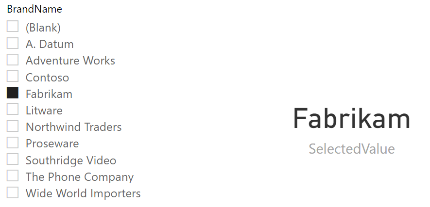

# Need to know Functions

**[SELECTEDVALUE](https://dax.guide/selectedvalue/)** <br>
Returns the value when there’s only one value in the specified column, otherwise returns the alternate result.

```dax
SelectedValue = 
    SELECTEDVALUE('Product'[BrandName], "Invalid Selection")
```
 <br>

**[SWITCH](https://dax.guide/switch/)** <br>
Returns different results depending on the value of an expression.

```dax
SwitchStatement = 
VAR varCheckValue = "B"
VAR varSwitch =
    SWITCH (
        varCheckValue,
        "A", "The Value is A",
        "B", "The Value is B",
        "C", "The Value is C",
        "Other Value"
    )
RETURN
    varSwitch

//Or using SWITCH True for same result

SwitchStatement = 
VAR varCheckValue = "B"
VAR varSwitch =
    SWITCH (
        TRUE,
        varCheckValue = "A", "The Value is A",
        varCheckValue = "B", "The Value is B",
        varCheckValue = "C", "The Value is C",
        "Other Value"
    )
RETURN
    varSwitch

```

 <br>

**[FORMAT](https://dax.guide/format/)** <br>
Converts a value to text in the specified number format.

```dax
Format =
VAR D =
    DATE ( 2021, 1, 2 )
VAR T =
    TIME ( 15, 30, 0 )
VAR DT = D + T
RETURN
    FORMAT ( DT, "Short Date" )
```

 <br>

**[CONVERT](https://dax.guide/convert/)** <br>
Convert an expression to the specified data type.

```dax
Convert =
VAR stringDt = "12-31-2021" 

RETURN CONVERT ( stringDt, DATETIME )
```

 <br>

**[COUNTROWS](https://dax.guide/countrows/)** <br>
Counts the number of rows in a table.

```dax
Countrows =
VAR filteredBrand =
    VALUES ( 'Product'[BrandName] )
RETURN
    COUNTROWS ( filteredBrand )
```

 <br>

**[ISFILTERED](https://dax.guide/isfiltered/)** <br>
Returns true when there are direct filters on the specified column.

```dax
IsFiltered = 
    ISFILTERED('Product'[BrandName])
```

 <br>

**[ISCROSSFILTERED](https://dax.guide/iscrossfiltered/)** <br>
Returns true when the specified table or column is crossfiltered.

```dax
IsCrossFiltered = 
    ISCROSSFILTERED('Product'[BrandName])
```

 <br>

**[FIRSTNONBLANK](https://dax.guide/firstnonblank/)** <br>
Returns the first value in the column for which the expression has a non blank value.

```dax
FirstNonBlank = 
    FIRSTNONBLANK('Calendar'[Date], [Profit])
```

 <br>

**[FIRSTNONBLANKVALUE](https://dax.guide/firstnonblankvalue/)** <br>
Returns the first non blank value of the expression that evaluated for the column.

```dax
FirstNonBlankValue = 
    FIRSTNONBLANKVALUE('Calendar'[Date], [Profit])
```

 <br>

**[RANKX](https://dax.guide/rankx/)** <br>
Returns the rank of an expression evaluated in the current context in the list of values for the expression evaluated for each row in the specified table.

```dax
RankX = 
    RANKX(ALL('Product'[BrandName]), [Profit])
```

 <br>

## Time Intelligence
Time intelligence functions support calculations to compare and aggregate data over time periods, supporting days, months, quarters, and years.
**You need a  gapless  Date-Table with a Date column in your model to make these functions work.**

**[DATESYTD](https://dax.guide/datesytd/)** <br>
Returns a set of dates in the year up to the last date visible in the filter context.

**[SAMEPERIODLASTYEAR](https://dax.guide/sameperiodlastyear/)** <br>
Returns a set of dates in the current selection from the previous year.

**[DATEADD](https://dax.guide/dateadd/)** <br>
Moves the given set of dates by a specified interval.
<br>
And many more… **[Link](https://docs.microsoft.com/en-us/dax/time-intelligence-functions-dax)**
