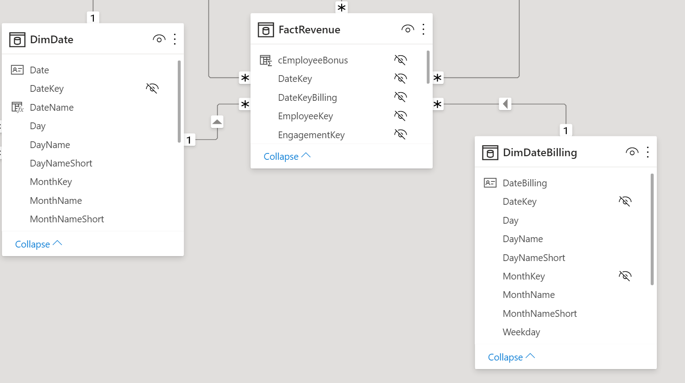
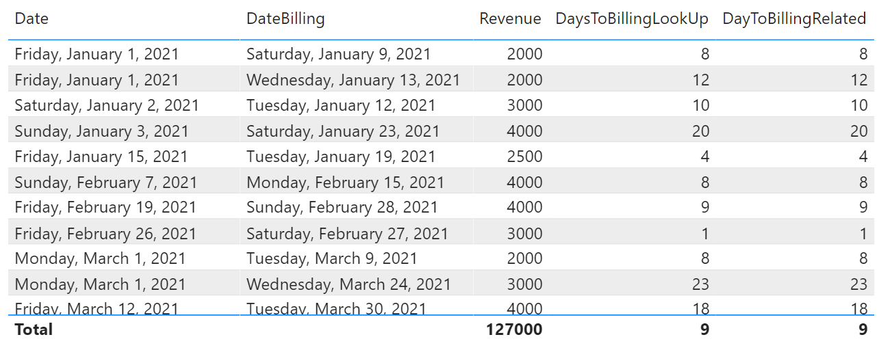

# Date Diff

This example is about calculating the difference of two dates. In our case we want to calculate the time between the booking of the hours and the invoicing. Two separate time dimensions have been created in the model for this purpose.

 <br>

## Option 1: Using virtual Relationship

In this approach, we iterate over all posted sales. Since we are working on row level using the row context, we can use the LOOKUP function to pull the corresponding dates from the date tables. Then we can calculate the difference using the DATEDIFF function

```dax
DaysToBillingLookUp = 
VAR tblRevenue =
    SELECTCOLUMNS (
        FactRevenue,
        "FactRevenue[DateKey]", FactRevenue[DateKey],
        "FactRevenue[DateKeyBilling]", FactRevenue[DateKeyBilling]
    )
RETURN
    AVERAGEX (
        ADDCOLUMNS (
            tblRevenue,
            "BookingDate", LOOKUPVALUE ( DimDate[Date], DimDate[DateKey], FactRevenue[DateKey] ),
            "BillingDate", LOOKUPVALUE ( DimDate[Date], DimDate[DateKey], FactRevenue[DateKeyBilling] ),
            "@DateDiff",
                INT (
                    LOOKUPVALUE ( DimDate[Date], DimDate[DateKey], FactRevenue[DateKeyBilling] )
                        - LOOKUPVALUE ( DimDate[Date], DimDate[DateKey], FactRevenue[DateKey] )
                )
        ),
        [@DateDiff]
    )
```

## Option 2: Using physical Relationship

The simpler and also from a performance point of view better approach, is to use the RELATED function. Here we also iterate over the facts, but we can easily reach the corresponding dates through the expanded table and thus calculate the difference.

```dax
DayToBillingRelated = 
AVERAGEX(FactRevenue, DATEDIFF(RELATED(DimDate[Date]), RELATED(DimDateBilling[DateBilling]), DAY))
```

## Result

 <br>