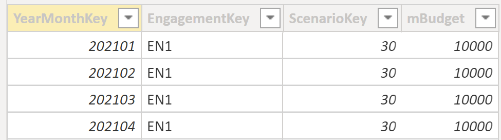
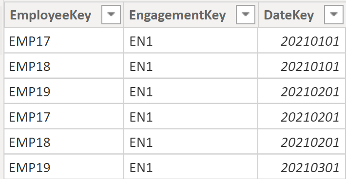
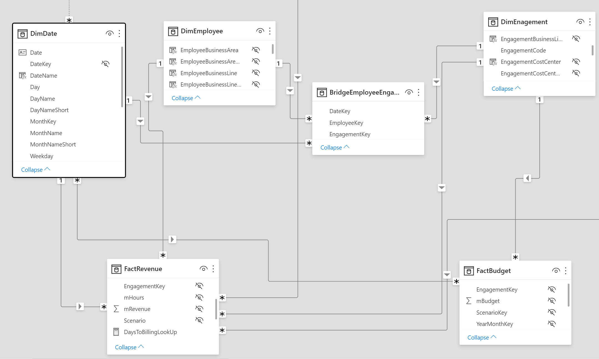
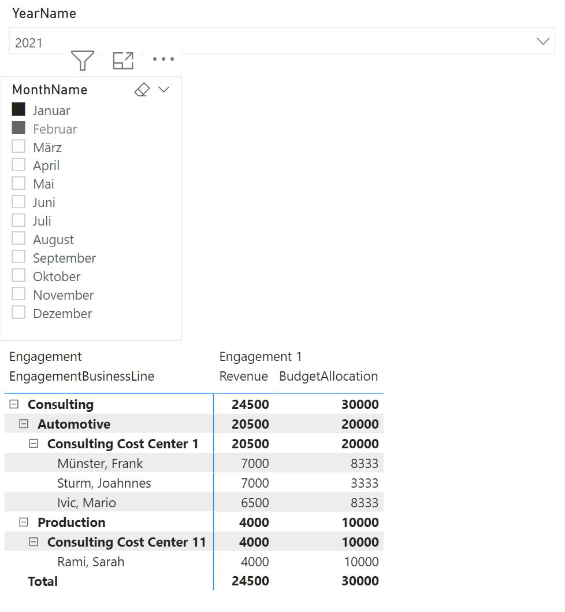

# Budget Allocation
When distributing budget, it often happens that the granularity of the data differs. As in our example, an employee enters the hours or the revenue on a daily key. The budget, on the other hand, is planned only per engagement on a monthly key. The budget should now be broken down to the employees who are on the Engagement at the time.

## Preparation

A fact table is needed, which assigns a monthly budget to each engagement.

 <br>

With the help of a bridge table, the employees are then assigned to the respective projects.

 <br>

model view

 <br>

## Implementation

For the implementation it is important that the budget that has already been distributed is also taken into account. In the following example, two employees are in the first month on the engagement, so these two can share the budget. In the third month, another colleague is added. Now, of course, this must not be taken into account for the first month. Therefore, only the open budget from month 2 may still be distributed

```dax
BudgetAllocation = 
VAR Employee =
    SELECTEDVALUE ( DimEmployee[EmployeeKey] )
VAR Engagement =
    SELECTEDVALUE ( DimEnagement[EngagementCode] )
VAR maxYearMonthKey =
    MAX ( DimDate[YearMonthKey] )
VAR minYearMonthKey =
    MIN ( DimDate[YearMonthKey] )
VAR tbl =
    DISTINCT (
        SELECTCOLUMNS (
            CALCULATETABLE ( DimDate, DimDate[YearMonthKey] <= maxYearMonthKey ),
            "DimDate[YearMonthKey]", DimDate[YearMonthKey]
        )
    )
VAR tblDateEngEmp =
    CROSSJOIN (
        CROSSJOIN ( tbl, VALUES ( DimEmployee[EmployeeKey] ) ),
        VALUES ( DimEnagement[EngagementCode] )
    )
VAR tblGenerate =
    GENERATE (
        tblDateEngEmp,
        VAR varYearMonthKey = [YearMonthKey]
        VAR varEmployeeKey = [EmployeeKey]
        VAR varEngagementCode = [EngagementCode]
        VAR varRevenue = [Revenue]
        VAR EmployeeAllocatedBudget =
            COUNTROWS (
                CALCULATETABLE (
                    BridgeEmployeeEngagement,
                    DimEmployee[EmployeeKey] = varEmployeeKey,
                    DimEnagement[EngagementCode] = varEngagementCode,
                    DimDate[YearMonthKey] = varYearMonthKey
                )
            )
        VAR varBudget =
            IF ( EmployeeAllocatedBudget, [Budget] )
        VAR varCountEmpOnProject =
            CALCULATE (
                COUNTROWS ( BridgeEmployeeEngagement ),
                REMOVEFILTERS ( DimEmployee )
            )
        VAR BudgetCumulated =
            CALCULATE (
                [Budget],
                REMOVEFILTERS ( DimDate ),
                DimDate[YearMonthKey] <= varYearMonthKey
            )
        VAR varBudgetAllocation =
            DIVIDE ( varBudget, varCountEmpOnProject )
        RETURN
            ROW (
                "@Revenue", varRevenue,
                "@Budget", varBudget,
                "@CountEmpOnProject", varCountEmpOnProject,
                "@BudgetCumulated", BudgetCumulated,
                "@BudgetAllocation", varBudgetAllocation
            )
    )
VAR Result =
    SUMX (
        FILTER (
            tblGenerate,
            [YearMonthKey] >= minYearMonthKey
                && [YearMonthKey] <= maxYearMonthKey
        ),
        [@BudgetAllocation]
    )
RETURN
    Result
```

## Result

 <br>
