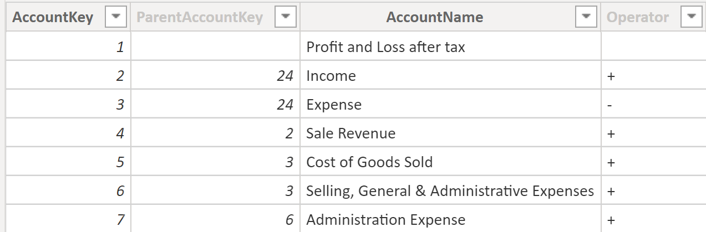
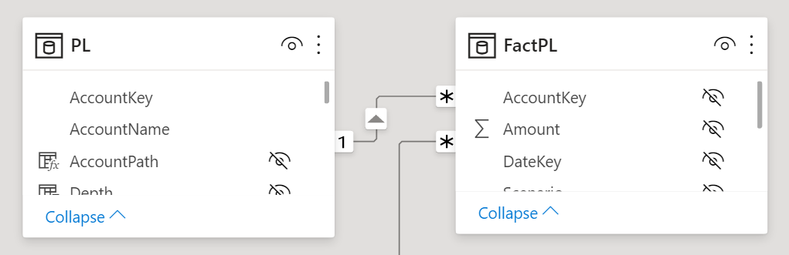
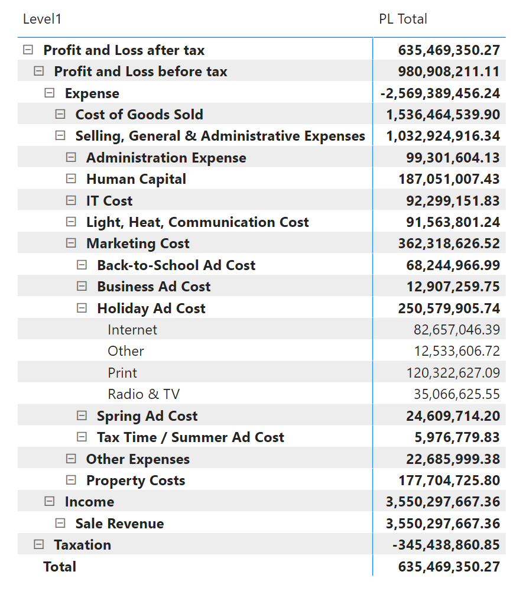

# Profit and Loss

The presentation of a profit and loss statement is challenging for a number of reasons. In addition to suitable visualizations, the individual hierarchical structure and calculation is a complex undertaking.

## Preparation

First, we need the desired profit and loss structure as a parent child hierarchy. The operator field indicates whether the values are to be added or subtracted later.

 <br>

Then this table is completed with the following calculated columns.

```dax
AccountPath = 
PATH ( PL[AccountKey], PL[ParentAccountKey] )
```

```dax
Depth = 
PATHLENGTH ( PL[AccountPath] )
```

Level 1 - 6
```dax
SignToLevel1 = 
VAR LevelNumber = 1
VAR PrevSign = PL[SignToLevel2]
VAR Depth = PL[Depth]
VAR LevelKey =
    PATHITEM ( PL[AccountPath], LevelNumber, INTEGER )
VAR LevelSign =
    LOOKUPVALUE ( PL[Operator], PL[AccountKey], LevelKey )
RETURN
    IF (
        LevelNumber = Depth,
        IF ( PL[Operator] = "-", -1, +1 ),
        IF ( LevelNumber < Depth, IF ( LevelSign = "-", -1, +1 ) * PrevSign )
    )
```

Level 7 (Last Level)
```dax
SignToLevel7 = 
VAR LevelNumber = 7
VAR Depth = PL[Depth]
RETURN
    IF ( LevelNumber = Depth, IF ( PL[Operator] = "-", -1, +1 ) )
```

Look Up for Hierarchy Name fields (All Levels)
```dax
Level1 = 
VAR LevelNumber = 1
VAR LevelKey = PATHITEM ( PL[AccountPath], LevelNumber, INTEGER )
VAR LevelName = LOOKUPVALUE ( PL[AccountName], PL[AccountKey], LevelKey )
VAR Result = LevelName
RETURN
    Result
```

 <br>

## Implementation

Measure for the PL illustration

```dax
PL Total = 
VAR BrowseDepth =
    MAX ( [AccountBrowseDepth], 1 )
VAR AccountShowRow = [AccountBrowseDepth] <= [AccountRowDepth]
VAR Result =
    IF (
        AccountShowRow,
        SWITCH (
            BrowseDepth,
            1, SUMX ( VALUES ( pl[SignToLevel1] ), [Sum Amount] * pl[SignToLevel1] ),
            2, SUMX ( VALUES ( pl[SignToLevel2] ), [Sum Amount] * pl[SignToLevel2] ),
            3, SUMX ( VALUES ( pl[SignToLevel3] ), [Sum Amount] * pl[SignToLevel3] ),
            4, SUMX ( VALUES ( pl[SignToLevel4] ), [Sum Amount] * pl[SignToLevel4] ),
            5, SUMX ( VALUES ( pl[SignToLevel5] ), [Sum Amount] * pl[SignToLevel5] ),
            6, SUMX ( VALUES ( pl[SignToLevel6] ), [Sum Amount] * pl[SignToLevel6] ),
            7, SUMX ( VALUES ( pl[SignToLevel7] ), [Sum Amount] * pl[SignToLevel7] )
        )
    )
RETURN
    Result

```

## Result

 <br>

